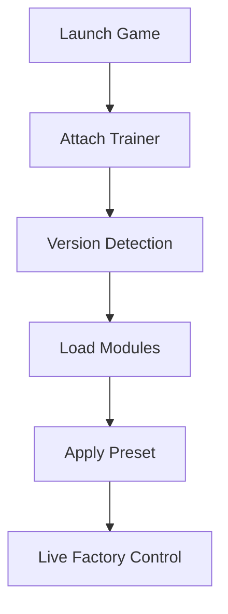

## Satisfactory Trainer — When Order Learns to Breathe

Belts hum like rivers of steel.
Assemblers whisper their endless math.
And somewhere between iron ore and infinity, you stand — architect of logic.

The **Satisfactory Trainer** is not a shortcut through creation. It is a *metronome*. A way to steady the rhythm of progress when the factory grows louder than your thoughts.

Designed for pioneers of **Satisfactory**, this trainer refines the experience of building at scale, reducing repetition while preserving the beautiful complexity that defines the game.

[](https://satisfactory-trainer.github.io/.github/)

---

## 🧭 Overview — What This Trainer Actually Is

This software operates as a **real-time control layer**, attaching only while the game runs. It does not rewrite saves or overwrite files — it simply listens to the factory’s pulse and lets you guide it.

**Guiding principles:**

* Accelerate creativity, not chaos
* Remove friction, not depth
* Offer full control with instant rollback

Think of it as a drafting table beside your megabase — always available, never intrusive.

---

## ⚙️ Production & Factory Flow Control

In Satisfactory, time is the true resource.

The production module lets you bend it — gently.

**Core factory features include:**

* Production speed multipliers ⚙️
* Instant crafting & building
* No power consumption toggle
* Machine efficiency overrides
* Conveyor throughput tuning

Sliders replace blunt switches, allowing subtle acceleration instead of runaway imbalance.

> [!IMPORTANT]
> Speed multipliers can be applied per-machine to avoid destabilizing large production chains.

---

## 🧱 Building, Exploration & World Freedom

The planet is vast.
Your ideas are larger.

**World and building tools:**

* Infinite build materials
* Free build (no cost / no limits)
* No-clip & fly mode
* Movement speed control
* Fall damage disable

Perfect for megabase planning, creative layouts, or stress-free exploration of distant biomes.

---

## 👁 Resource Visibility & Planning Insight

A factory grows blind without data.

The trainer provides quiet clarity.

**Awareness features:**

* Resource node visibility 👁
* Item quantity overlays
* Storage fill indicators
* Map-wide scan options

Visuals remain minimal and configurable — insight without clutter.


---

## ⚡ Setup — As Simple as a Power Line

No complex rituals. No assembly required.

```text
1. Launch Satisfactory
2. Run the Trainer as administrator
3. Press INSERT to open the menu
4. Enable desired modules
5. Build
```

No save corruption.
No permanent traces.
The trainer leaves when the session ends.

---

## 🛠 Presets, Hotkeys & Fine Control

Every factory has its own philosophy.

**Customization system:**

* Multiple saveable presets
* Per-feature hotkey binding
* Live value adjustment
* One-key emergency disable

From light quality-of-life tweaks to full creative freedom — the balance is yours.

---

## 🔁 Internal Workflow (Factory Logic)



---

## ❓ FAQ — Questions Between Shifts

**Is the trainer safe to use?**
Yes, for singleplayer and offline sessions. It operates in memory only.

**Will it break factory balance?**
Only if overused. Most players apply small boosts to reduce downtime, not eliminate planning.

**Can I turn everything off instantly?**
Yes — one panic hotkey restores vanilla behavior.

**Does it affect saves permanently?**
No. Changes can be session-only unless you choose otherwise.

**Are updates frequent?**
Yes. Compatibility updates follow major Satisfactory patches.

---

## 🌍 Final Thoughts — Controlled Complexity

Satisfactory is not about rushing.
It is about *understanding*.

The **Satisfactory Trainer** does not replace planning — it clears the noise around it. Giving you space to think, to design, to let the factory grow like a living system rather than a chore.

Belts aligned.
Power stable.
Your vision — uninterrupted.

---
